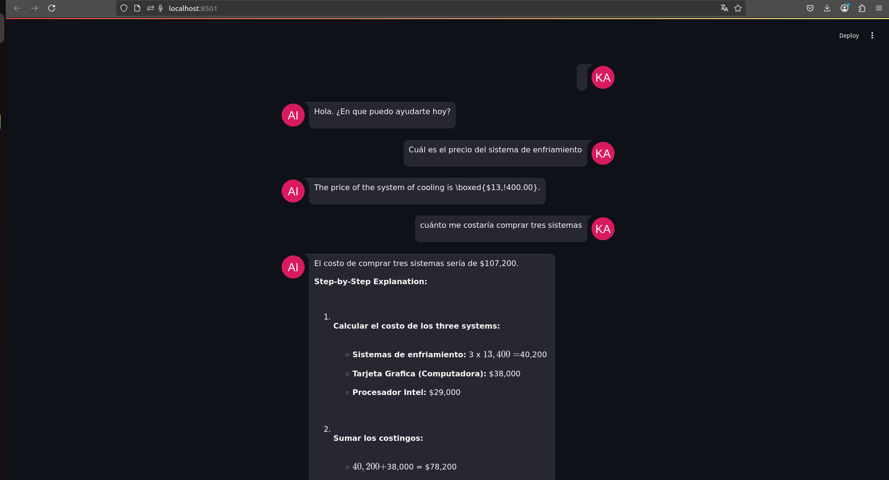
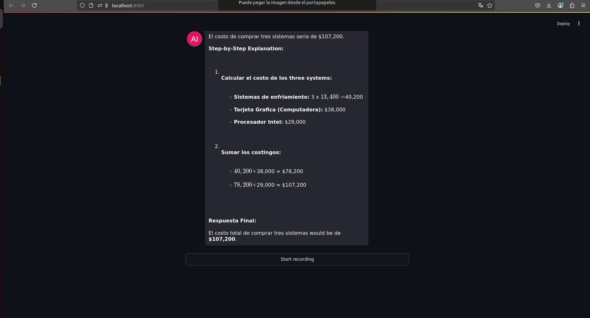

# Chatbot de consulta un documento CSV

# Objetivo
## Consultar información de un archivo CSV utilizado un modelo LLM.

# Resumen
## Se utiliza un modelo "deepseek-r1:1.5b" para crear un agente usando ollama con langchain. Tiene una interfaz tipo chatbot usando Streamlit, donde se usa audio para crear la entrada de consulta del usuario.

# Demostración del sistema

